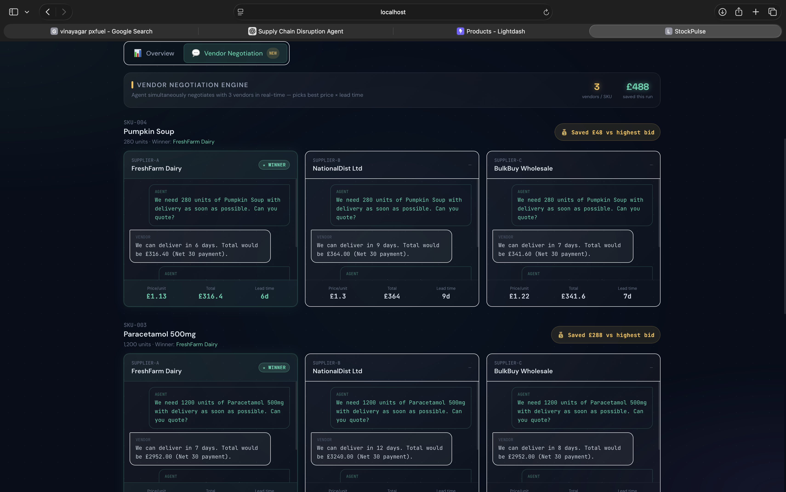
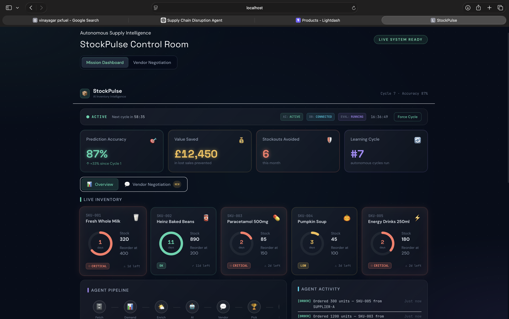
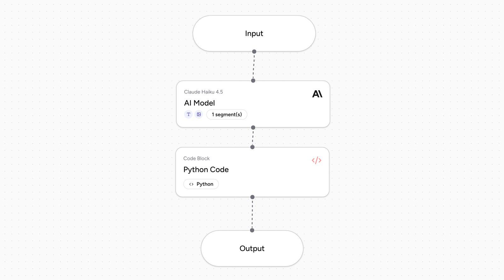

# StockPulse

**AI-powered supermarket inventory that prevents stockouts.**  
StockPulse uses real-world signals (weather, seasons, festivals), an AI agent to reason about *what* and *how much* to order, and multi-vendor negotiation to pick the best offer. All decisions are visible in a dashboard and in Lightdash.

---

## What Problem This Solves

- **Classic inventory systems** reorder when stock drops below a fixed point. They ignore weather, holidays, flu season, and competitor stockouts — so you either overstock or run out.
- **StockPulse** connects **weather APIs**, **seasonal and festival calendars**, and (optionally) **news or web search** for upcoming events. An **AI model** (Airia) reasons over inventory + these signals and decides which items to buy and in what quantity. A **vendor negotiation** layer gets 2–3 offers and picks the best one. **Lightdash** gives you live charts on top of the same data.

---

## Tools Used

| Tool | Role |
|------|------|
| **Airia** | The **AI brain**. Receives inventory + external signals (weather, season, festivals); outputs structured order decisions with reasoning (SKU, quantity, why). We call Airia via webhook; you configure the agent in the Airia UI. |
| **Lightdash** | **Analytics & dashboards**. Connects to the same Supabase (Postgres) database. No data is copied — Lightdash runs queries live. Use it for inventory timeline, days of stock, POs, lead time accuracy, seasonal velocity, and value saved. |
| **Supabase** | **Single source of truth**. Postgres for products, sales, suppliers, purchase_orders, agent_cycles. The backend and Lightdash both read/write or read from here. |
| **Open-Meteo** | **Weather API** (free, no key). We pull current temperature and conditions (e.g. London) and pass them to the AI; cold → more soup/milk, heat → more energy drinks. |
| **FastAPI backend** | Orchestrates the cycle: prioritization → signals → Airia → vendor negotiation → write POs to Supabase. |
| **React + Vite frontend** | Dashboard and Vendor Negotiation tab: run a cycle, see inventory, activity, and which vendor won each negotiation. |

*(News and web search for upcoming events can be added the same way as weather: call an API, put results into the `signals` payload to Airia, and let the AI factor them into order quantities.)*

---

## How It Works (End-to-End)

```
  ┌─────────────────────────────────────────────────────────────────────────┐
  │ 1. DATA                                                                  │
  │    Supabase: products (stock, reorder_point), sales (velocity_7day_avg)  │
  └───────────────────────────────────┬─────────────────────────────────────┘
                                      │
  ┌───────────────────────────────────▼─────────────────────────────────────┐
  │ 2. PRIORITIZATION                                                        │
  │    Compute days_remaining = current_stock / velocity; rank by urgency    │
  │    (low stock first). Top N “urgent” SKUs go to the agent.               │
  └───────────────────────────────────┬─────────────────────────────────────┘
                                      │
  ┌───────────────────────────────────▼─────────────────────────────────────┐
  │ 3. EXTERNAL SIGNALS (context for the AI)                                 │
  │    • Weather API (Open-Meteo) → temperature, conditions                 │
  │    • Season (date) → flu_season, pumpkin_soup_high_demand                │
  │    • Festivals (calendar) → Christmas, Easter, Halloween, Black Friday  │
  │    (News / web search for events: same pattern — add to signals object)   │
  └───────────────────────────────────┬─────────────────────────────────────┘
                                      │
  ┌───────────────────────────────────▼─────────────────────────────────────┐
  │ 4. AI (AIRIA)                                                            │
  │    Backend sends: { products: [...], signals: { weather, season, ... } } │
  │    Airia reasons: “Milk low + cold + Christmas → order more”; outputs    │
  │    [ { sku, quantity_ordered, agent_reasoning }, ... ]                  │
  └───────────────────────────────────┬─────────────────────────────────────┘
                                      │
  ┌───────────────────────────────────▼─────────────────────────────────────┐
  │ 5. VENDOR NEGOTIATION                                                    │
  │    For each order: request quotes from 2–3 simulated vendors;            │
  │    pick best (price + lead time); generate “conversation” for UI.       │
  └───────────────────────────────────┬─────────────────────────────────────┘
                                      │
  ┌───────────────────────────────────▼─────────────────────────────────────┐
  │ 6. WRITE BACK                                                           │
  │    Insert purchase_orders + agent_cycles in Supabase.                    │
  │    Lightdash and the app read the same DB → live charts and history.     │
  └─────────────────────────────────────────────────────────────────────────┘
```

- **No data is “pushed” into Lightdash.** Lightdash connects to Supabase and runs SQL when you open a chart. So “data in Lightdash” = data in Supabase.
- **Airia is stateless in our setup.** We send a snapshot (products + signals) each run and parse the agent’s JSON list of orders. The agent is configured once in the Airia UI (see `docs/AIRIA_AGENT_PROMPT.md`).

---

## Architecture (High-Level)

```
┌──────────────────────────────────────────────────────────────────────────────┐
│                              STOCKPULSE                                       │
├──────────────────────────────────────────────────────────────────────────────┤
│                                                                              │
│   ┌─────────────┐     ┌─────────────────────────────────────────────────┐   │
│   │   React     │     │              FastAPI Backend                     │   │
│   │   Frontend  │────▶│  • GET /api/dashboard, /api/activity             │   │
│   │   (Vite)    │     │  • POST /api/run-cycle                           │   │
│   │             │◀────│  • GET /api/vendor-negotiation                   │   │
│   └─────────────┘     │  • prioritization → signals → Airia → vendors    │   │
│         │             └──────────────┬──────────────────┬───────────────┘   │
│         │                            │                    │                   │
│         │                            │ HTTPS              │ HTTPS             │
│         │                            ▼                    ▼                   │
│         │                   ┌───────────────┐     ┌─────────────────┐          │
│         │                   │    Airia     │     │  Open-Meteo     │          │
│         │                   │  (AI agent)  │     │  (weather)      │          │
│         │                   │  Webhook     │     │  (no key)       │          │
│         │                   └───────────────┘     └─────────────────┘          │
│         │                            │                    │                   │
│         │                            └──────────┬─────────┘                   │
│         │                                       │                              │
│         │                                       ▼                              │
│         │                            ┌─────────────────────┐                   │
│         └──────────────────────────▶│      Supabase       │◀───────────────────┤
│                                     │  (Postgres)         │                    │
│                                     │  products, sales,   │   Lightdash         │
│                                     │  suppliers,        │   (live SQL to      │
│                                     │  purchase_orders,   │   same DB)          │
│                                     │  agent_cycles       │                    │
│                                     └─────────────────────┘                    │
│                                                                              │
└──────────────────────────────────────────────────────────────────────────────┘
```

---

## UI / Screenshots

### Dashboard

*Main dashboard with inventory, KPIs, agent pipeline, and run cycle.*

### Dashboard (alternate view)

*Dashboard with activity feed and vendor negotiation context.*

### Lightdash

*Lightdash Explore — run queries and build charts on top of your Supabase data (e.g. days of stock, POs timeline).*

---

## Quick Start

### 1. Backend

```bash
cd backend
cp .env.example .env   # set SUPABASE_URL, SUPABASE_KEY, AIRIA_WEBHOOK_URL, AIRIA_API_KEY
pip install -r requirements.txt
uvicorn main:app --reload --port 8000
```

Use the **anon (public)** JWT from Supabase (Project Settings → API) as `SUPABASE_KEY`. Run `supabase_schema.sql` in the Supabase SQL Editor if tables don’t exist.

### 2. Frontend

```bash
cd frontend
npm install
npm run dev
```

Open **http://localhost:3000**. Use “Run cycle” to trigger the agent; check the Vendor Negotiation tab for conversations and chosen vendors.

### 3. Airia

Create an agent in the Airia UI and paste the prompt from **`docs/AIRIA_AGENT_PROMPT.md`**. Set the webhook URL and API key in `backend/.env`.

### 4. Lightdash

```bash
cd lightdash
npm install -g @lightdash/cli
lightdash login
lightdash deploy --create --no-warehouse-credentials
```

In Lightdash: Project settings → Warehouse → Postgres → add your Supabase connection (host, user, password, db `postgres`, schema `public`). See **`docs/LIGHTDASH_SETUP.md`** for full steps and “no data” troubleshooting.

---

## Docs

| Doc | Description |
|-----|-------------|
| **idea.md** | Full product spec, schema, and build steps. |
| **docs/LIGHTDASH_SETUP.md** | Lightdash YAML project, deploy, and Supabase connection. |
| **docs/AIRIA_AGENT_PROMPT.md** | Prompt to paste in Airia to build the inventory agent. |
| **docs/AIRIA_API_REFERENCE.md** | Airia API / webhook notes. |
| **backend/README.md** | Backend setup and env vars. |

---

## Extending: News & Web Search

To add **upcoming events** (e.g. local events, news, or web search):

1. In the backend, add a function (e.g. in `signals.py`) that calls your chosen API or search service.
2. Append the result to the `signals` dict (e.g. `signals["events"] = [...]` or `signals["news_snippet"] = "..."`).
3. Pass the same `signals` object to `_call_airia()` in `run_cycle.py` — the AI already receives `signals` and can reason over new keys.
4. In the Airia agent prompt, describe how to use this new field (e.g. “If `signals.events` mentions a festival or run, add a 15% buffer for relevant SKUs”).

No change is needed in Lightdash unless you store event metadata in Supabase and want to chart it.

---

## License

See repository.
